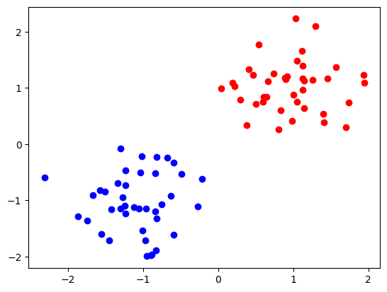
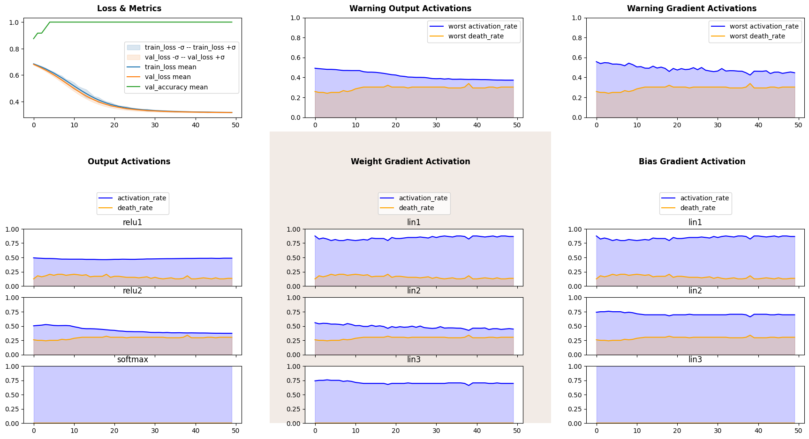
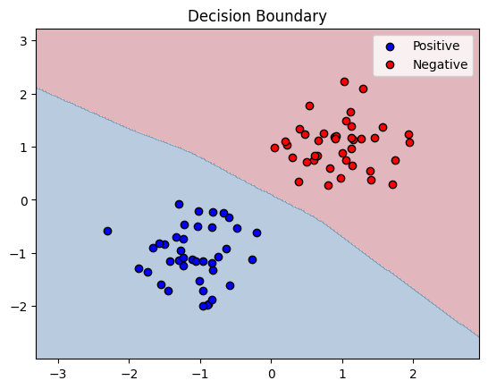
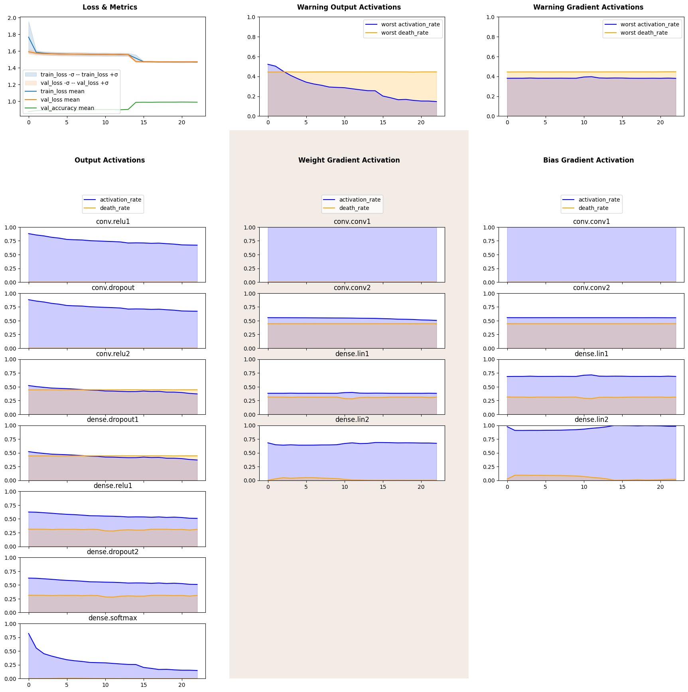
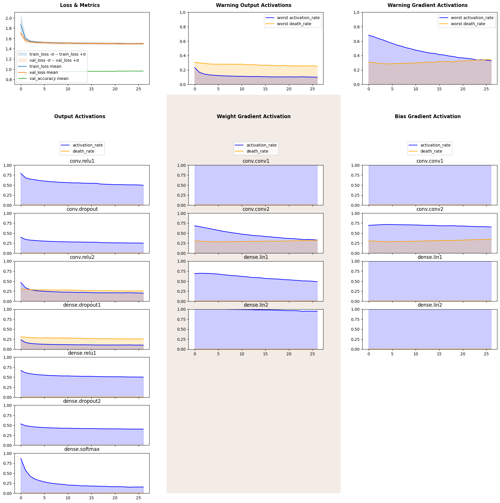

Activations
===========

Abstract
--------

In this notebook we discuss tracking of activations of layers by outputs
and by parameter gradients. Firstly we analyse binary classification of
linearly separable data and then we proceed to examine effect of dropout
layers on deep convolutional layer for classification on MNIST dataset.
For a much deeper dive see `Neuron Death in ANNs: detecting and
troubleshooting <https://ai.gopubby.com/neuron-death-in-anns-detecting-and-troubleshooting-4a7b5cc2f099>`__
by Malcolm Lett.

Imports
-------

.. code:: ipython3

    import numpy as np
    import pandas as pd
    import matplotlib.pyplot as plt
    
    import torch
    import torch.nn as nn
    from torch.utils.data import DataLoader, TensorDataset
    
    RND_SEED = 42
    device = torch.device('cuda' if torch.cuda.is_available() else 'cpu')
    device

.. parsed-literal::

    device(type='cuda')

Activation Lenses
-----------------

The whole idea of activation stems from the ReLU and sigmoid activations
functions being zero or near-zero for a subset of real numbers. Zeros
being multiplicatevily absorbing and additively neutral element does not
interact with linear combinations, thus not propagating any information
further. Thus a dead neuron is a neuron that does not propagate any
information for all of the samples in a training iteration (batch),
death rate is a proportion of dead neurons, activation rate is a
proportion of outputs activited thorugh a dataset pass. This idea is
represented by ``OutputActivation`` lens, on every forward pass through
a layer outputs are put to be either active or inactive; death and
activation rates are then calculated.

``OutputNorm`` records data for all activations functions and dropout by
default. Its behavious can be configured by ``activation``, ``dropout``,
``include`` and ``exclude`` flags.

If neuron is dead, i.e., its outputs are constant, it will have a zero
gradient; therefore both activation and death rate can be reconstructed
from gradients with respect to neuron’s parameters. This idea is
implemented in ``ParameterGradientActivation`` lens. Note that it does
not hook onto a module, but on parameter tensors, and PyTorch allows to
hook only onto non-lazy tensors, hence lazy modules’ gradients (such as
``nn.LazyLinear``) cannot be tracked by this lens.

``ParameterGradientActivation`` records data for all layer that have all
of the parameters listed in ``parameters`` initialization arguments,
default are ``"weight"`` and ``"bias"``.

Both plots allow for warning plot that plots minimal activation rate and
maximal death rate accross all layers (and parameters).

It is common to implement activation functions as a functional calls to
``torch.nn.functional``, that way no output data can be captured using
callbacks, ``ParameterGradientActivation`` then might help you examine
your network.

Let us define the inspector with those lenses.

.. code:: ipython3

    from monitorch.inspector import PyTorchInspector
    from monitorch.lens import LossMetrics, OutputActivation, ParameterGradientActivation
    
    loss_fn = nn.CrossEntropyLoss()
    
    inspector = PyTorchInspector(
        lenses = [
            LossMetrics(
                loss_fn=loss_fn,
                separate_loss_and_metrics=False,
                metrics=['val_accuracy']
            ),
            OutputActivation(),
            ParameterGradientActivation()
        ]
    )

We will also define generic functions for training and validation.

.. code:: ipython3

    def train_one_epoch(model, loss_fn, optimizer, train_dataloader, device=device):
        """ Trains model through dataset one time. """
        for data, label in train_dataloader:
            data = data.to(device)
            label = label.to(device)
            optimizer.zero_grad()
            pred = model(data)
            loss = loss_fn(pred, label)
            loss.backward()
            optimizer.step()
    
    @torch.no_grad
    def validate_one_epoch(model, loss_fn, val_dataloader, device=device):
        """ Validates through given dataset. """
        correctly_classified = 0
        n_samples = 0
        for data, label in val_dataloader:
            data = data.to(device)
            label = label.to(device)
            pred = model(data)
            loss = loss_fn(pred, label)
            n_samples += data.shape[0]
            correctly_classified += pred.argmax(dim=1).eq(label).float().sum().item()
        return correctly_classified / n_samples

2D Examples
-----------

Activation rate can be seen as a measure of entropy of a layer, because
task-relative informative features requires model to differentiate more
complex and less common patterns. A notorious example would be that
first layers of convolutional networks learn to distinguish between
lines and angles, while the last can detect parts of face.

Death rate on the other hand can be interpreted as a measure of layer’s
overcapacity under given architecture. Gradient-based optimization
methods are well-known to find the easiest solution for a problem, sadly
sometimes the easiest solution is to kill a neuron.

To illustrate our take we will train highly overparameterized network
for a linearly separable case.

Let us define function for further ease of use.

.. code:: ipython3

    def plot_decision_boundary(model, X, y, ax=None, resolution=0.02):
        """
        Plots decision boundary for a binary classifier.
        model: trained PyTorch model
        X: torch.Tensor or np.ndarray of shape (N, 2)
        y: torch.Tensor or np.ndarray of shape (N,) or (N,1)
        """
        if ax is None:
            fig, ax = plt.subplots()
    
        # Convert tensors to numpy if needed
        if torch.is_tensor(X):
            X = X.detach().cpu().numpy()
        if torch.is_tensor(y):
            y = y.detach().cpu().numpy()
    
        # Determine grid range
        x_min, x_max = X[:, 0].min() - 1, X[:, 0].max() + 1
        y_min, y_max = X[:, 1].min() - 1, X[:, 1].max() + 1
        xx, yy = np.meshgrid(np.arange(x_min, x_max, resolution),
                             np.arange(y_min, y_max, resolution))
    
        # Prepare grid for prediction
        grid = np.c_[xx.ravel(), yy.ravel()]
        grid_tensor = torch.tensor(grid, dtype=torch.float32)
    
        # Get predictions
        model.eval()
        with torch.no_grad():
            preds = model(grid_tensor)[:, 1].cpu().numpy()
            Z = (preds > 0.5).astype(int)               # binary mask
    
        Z = Z.reshape(xx.shape)
    
        # Plot decision boundary
        ax.contourf(xx, yy, Z, alpha=0.3, cmap=plt.cm.RdBu)
    
        # Plot original points
        ax.scatter(X[y==1, 0], X[y==1, 1], c='b', edgecolor='k', label="Positive")
        ax.scatter(X[y==0, 0], X[y==0, 1], c='r', edgecolor='k', label="Negative")
    
        ax.legend()
        ax.set_title("Decision Boundary")
        plt.show()
    
    def make_dataloaders(pos, neg):
        X = np.vstack((pos, neg))
        y = np.hstack((np.ones(len(pos)), np.zeros(len(neg))))
        
        X_tensor = torch.tensor(X, dtype=torch.float32)
        y_tensor = torch.tensor(y, dtype=torch.long)
        
        full_dataset = TensorDataset(X_tensor, y_tensor)
        
        # Split into train and validation (e.g., 70% train / 30% val)
        train_size = int(0.7 * len(full_dataset))
        val_size = len(full_dataset) - train_size
        train_dataset, val_dataset = torch.utils.data.random_split(full_dataset, [train_size, val_size],
                                                  generator=torch.Generator().manual_seed(RND_SEED))
        
        train_loader = DataLoader(train_dataset, batch_size=8, shuffle=True)
        val_loader = DataLoader(val_dataset, batch_size=8, shuffle=False)
        return train_loader, val_loader

We will create two 2D populations both coming from a scaled gaussian
distribution with different means.

.. code:: ipython3

    np.random.seed(RND_SEED)
    pos = np.random.standard_normal(size=(40, 2))*0.5 -1
    neg = np.random.standard_normal(size=(40, 2))*0.5 +1
    X = np.vstack((pos, neg))
    y = np.hstack((np.ones(len(pos)), np.zeros(len(neg))))
    plt.scatter(pos[:, 0], pos[:, 1], color='b')
    plt.scatter(neg[:, 0], neg[:, 1], color='r')
    train_lin_loader, validate_lin_loader = make_dataloaders(pos, neg)

We see that data is clearly linearly separable, therefore a 3-parameter
1-layer neural network (logistic regression) would be able to learn to
classify these data perfectly. Instead we will define a model with
additional layer with 16 neurons, pumping number of parameters to be
over three hundread.

.. code:: ipython3

    from collections import OrderedDict
    
    model = nn.Sequential(OrderedDict([
        ('lin1', nn.Linear(2, 16)),
        ('relu1', nn.ReLU()),
    
        ('lin2', nn.Linear(16, 16)),
        ('relu2', nn.ReLU()),
        
        ('lin3', nn.Linear(16, 2)),
        ('softmax', nn.Softmax(dim=1))
    ])).to(device)
    inspector.attach(model)
    optimizer = torch.optim.Adam(model.parameters())
    
    N_EPOCH = 50
    for epoch in range(N_EPOCH):
        train_one_epoch(model, loss_fn, optimizer, train_lin_loader)
        val_acc = validate_one_epoch(model, loss_fn, validate_lin_loader)
        inspector.push_metric('val_accuracy', val_acc)
        inspector.tick_epoch()
    
    fig = inspector.visualizer.show_fig()
    plot_decision_boundary(model.cpu(), X, y)

We see that both gradient and output death rates of the second
(redundant) layer are high, though they do not converge to give minimal
possible result of 81.5%, where the second layer would effectively have
2 neurons.

MNIST
-----

Now we will show how activations work on an example where it is not as
easy to come up with correct number of parameters and how one could
influence model’s activations.

Firstly we will download MNIST dataset.

.. code:: ipython3

    from torchvision.datasets import MNIST
    import torchvision.transforms as transforms
    
    transform = transforms.Compose([
            transforms.ToTensor(),
            transforms.Normalize((0.5,), (0.5,))
    ])
    
    trainset = MNIST(
        './data',
        download=True,
        train=True,
        transform=transform
    )
    
    testset = MNIST(
        './data',
        download=True,
        train=False,
        transform=transform
    )
    BATCH_SIZE = 256
    trainloader = torch.utils.data.DataLoader(trainset, batch_size=BATCH_SIZE, shuffle=True, num_workers=2)
    
    validateloader = torch.utils.data.DataLoader(testset, batch_size=BATCH_SIZE, shuffle=False, num_workers=2)

.. parsed-literal::

    100%|██████████| 9.91M/9.91M [00:00<00:00, 57.3MB/s]
    100%|██████████| 28.9k/28.9k [00:00<00:00, 1.73MB/s]
    100%|██████████| 1.65M/1.65M [00:00<00:00, 14.8MB/s]
    100%|██████████| 4.54k/4.54k [00:00<00:00, 6.47MB/s]

We will define custom convolutional network with controllable dropout
parameter between two convolutional layers, convolutional and fully
connected part and before the output layer.

.. code:: ipython3

    class CNN(nn.Module):
    
        def __init__(self, dropout=(0, 0, 0)):
            super().__init__()
            self.conv = nn.Sequential(OrderedDict([
                ('conv1', nn.Conv2d(1, 64, kernel_size=7, padding='same')),
                ('pool1', nn.MaxPool2d(kernel_size=7)),
                ('relu1', nn.ReLU()),
    
                ('dropout', nn.Dropout(dropout[0])),
    
                ('conv2', nn.Conv2d(64, 128, kernel_size=4)),
                ('relu2', nn.ReLU()),
            ]))
    
            self.dense = nn.Sequential(OrderedDict([
                ('dropout1', nn.Dropout(dropout[1])),
                ('lin1',  nn.Linear(128, 32)),
                ('relu1', nn.ReLU()),
                
                ('dropout2', nn.Dropout(dropout[2])),
                ('lin2',    nn.Linear(32, 10)),
                ('softmax', nn.Softmax(dim=1))
            ]))
    
        def forward(self, X):
            t = torch.flatten(self.conv(X), start_dim=1)
            return self.dense(t)

We will also use an early stopping mechanism.

.. code:: ipython3

    class EarlyStopper:
        def __init__(self, patience : int = 5, eps : float = 1e-3):
            self.loss = float('+inf')
            self.timer = 0
            self.eps = eps
            self.patience = patience
    
        def __call__(self, new_loss : float) -> bool:
            if self.loss - new_loss > self.eps:
                self.loss = new_loss
                self.timer = 0
                return False
            self.timer += 1
            return self.timer >= self.patience

Finally let us train a network without dropout and see its activation
and death rates.

.. code:: ipython3

    from tqdm import trange
    model = CNN().to(device)
    
    stopper = EarlyStopper()
    inspector.attach(model)
    optimizer = torch.optim.Adam(model.parameters())
    
    N_EPOCH = 50
    for epoch in trange(N_EPOCH):
        train_one_epoch(model, loss_fn, optimizer, trainloader)
        val_acc = validate_one_epoch(model, loss_fn, validateloader)
        inspector.push_metric('val_accuracy', val_acc)
        inspector.tick_epoch()
        if stopper(inspector.lenses[0].loss(train=False)):
            break
    
    fig = inspector.visualizer.show_fig()

.. parsed-literal::

     44%|████▍     | 22/50 [04:06<05:13, 11.20s/it]

Our network has reached impressive accuracy and at the same time second
convolutional and first dense layers are half dead. Another peculiar
feature of this plot is a steady decline of output activation as model
learns to distinguish between digits. It is even more interesting with a
softmax layer, as its activation rate falls steadily and reaches
approximately 10%, coinciding with the last elbow on a loss and metrics
plot. 10% activation is exactly one output of softmax layer being
non-zero, thus predicting correct digit.

Let us now train the very same network, but heavily regulirize half dead
layers and put a weak constrain on the output layer.steadily

.. code:: ipython3

    from tqdm import trange
    model = CNN(dropout=(0.5, 0.5, 0.2)).to(device)
    
    stopper = EarlyStopper()
    inspector.attach(model)
    optimizer = torch.optim.Adam(model.parameters())
    
    N_EPOCH = 50
    for epoch in trange(N_EPOCH):
        train_one_epoch(model, loss_fn, optimizer, trainloader)
        val_acc = validate_one_epoch(model, loss_fn, validateloader)
        inspector.push_metric('val_accuracy', val_acc)
        inspector.tick_epoch()
        if stopper(inspector.lenses[0].loss(train=False)):
            break
    
    fig = inspector.visualizer.show_fig()

.. parsed-literal::

     52%|█████▏    | 26/50 [04:44<04:22, 10.94s/it]

Firsly we see a that the first dense layer had almost no dead gradient,
as well as, its activation function stopped producing dead outputs. Both
activations and death rate of the second convolutional layer declined.
Loss plots show less variance and softmax activation rate declined
smoother with no hard elbows. All of that is a result of dropout
reducing effective size of a model and its variance.

What to Look for
----------------

-  Keep death rates low possible using dropout, dead neuron does not
   contribute to network at all. Occasionally dropped out neuron helps
   to generalize.
-  Output (ReLU) and gradient activations start at roughly 50% and 100%
   activations. Layers closer to the output should drive their
   activation rates lower, because they need to accept and reject more
   often.

Next Steps
----------

-  Read `an
   article <https://ai.gopubby.com/neuron-death-in-anns-detecting-and-troubleshooting-4a7b5cc2f099>`__
   by Malcolm Lett.
-  Take a look at other demonstration notebooks and documentation.
-  Experiment with dropout at different parts of network.
-  Find what activation flavour fits your codebase and habits best.

