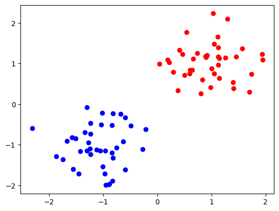
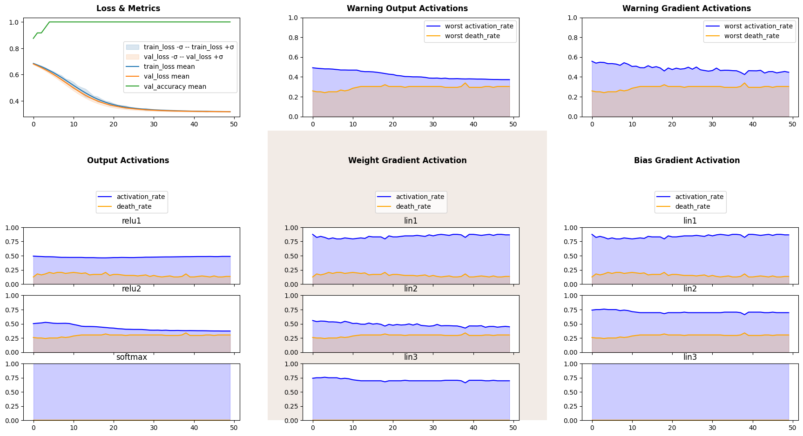
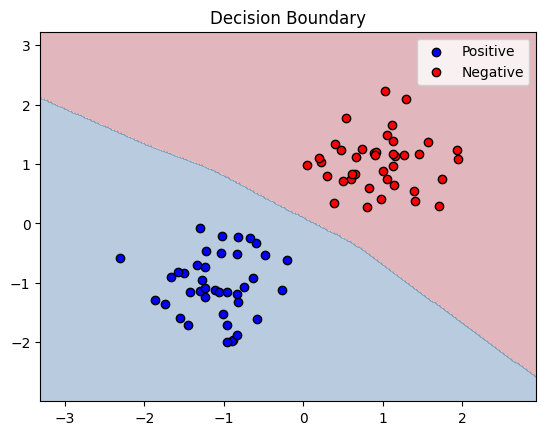
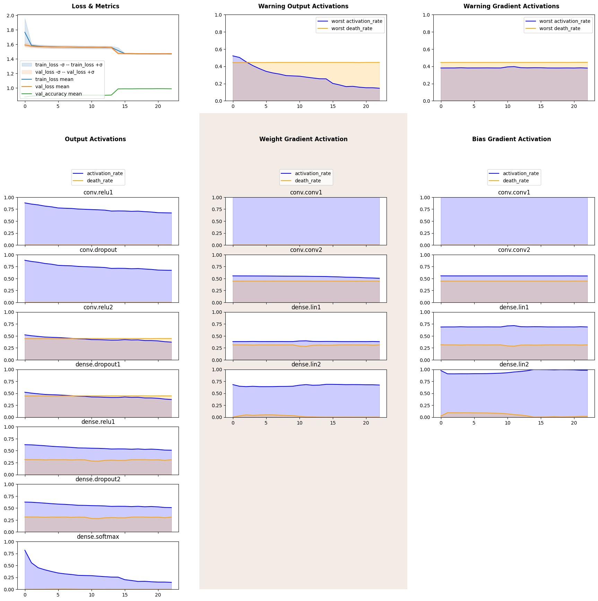
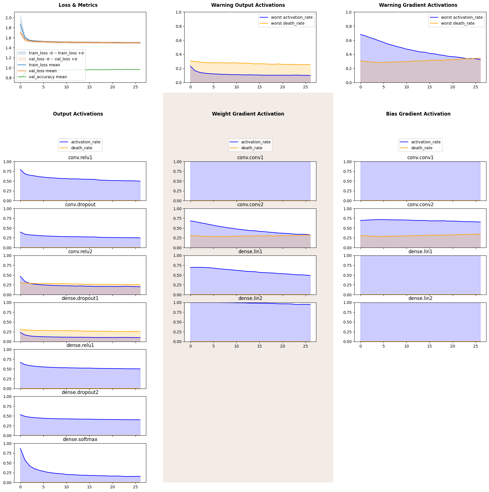

Activations
===========

Abstract
--------

Imports
-------

.. code:: ipython3

    import numpy as np
    import pandas as pd
    import matplotlib.pyplot as plt
    
    import torch
    import torch.nn as nn
    from torch.utils.data import DataLoader, TensorDataset
    
    RND_SEED = 42
    device = torch.device('cuda' if torch.cuda.is_available() else 'cpu')
    device

.. parsed-literal::

    device(type='cuda')

Activation Lenses
-----------------

.. code:: ipython3

    from monitorch.inspector import PyTorchInspector
    from monitorch.lens import LossMetrics, OutputActivation, ParameterGradientActivation
    
    loss_fn = nn.CrossEntropyLoss()
    
    inspector = PyTorchInspector(
        lenses = [
            LossMetrics(
                loss_fn=loss_fn,
                separate_loss_and_metrics=False,
                metrics=['val_accuracy']
            ),
            OutputActivation(),
            ParameterGradientActivation()
        ]
    )

.. parsed-literal::

    2025-08-14 14:19:14.117370: E external/local_xla/xla/stream_executor/cuda/cuda_fft.cc:477] Unable to register cuFFT factory: Attempting to register factory for plugin cuFFT when one has already been registered
    WARNING: All log messages before absl::InitializeLog() is called are written to STDERR
    E0000 00:00:1755181154.332141      19 cuda_dnn.cc:8310] Unable to register cuDNN factory: Attempting to register factory for plugin cuDNN when one has already been registered
    E0000 00:00:1755181154.395725      19 cuda_blas.cc:1418] Unable to register cuBLAS factory: Attempting to register factory for plugin cuBLAS when one has already been registered

.. code:: ipython3

    def train_one_epoch(model, loss_fn, optimizer, train_dataloader, device=device):
        """ Trains model through dataset one time. """
        for data, label in train_dataloader:
            data = data.to(device)
            label = label.to(device)
            optimizer.zero_grad()
            pred = model(data)
            loss = loss_fn(pred, label)
            loss.backward()
            optimizer.step()
    
    @torch.no_grad
    def validate_one_epoch(model, loss_fn, val_dataloader, device=device):
        """ Validates through given dataset. """
        correctly_classified = 0
        n_samples = 0
        for data, label in val_dataloader:
            data = data.to(device)
            label = label.to(device)
            pred = model(data)
            loss = loss_fn(pred, label)
            n_samples += data.shape[0]
            correctly_classified += pred.argmax(dim=1).eq(label).float().sum().item()
        return correctly_classified / n_samples

2D Examples
-----------

.. code:: ipython3

    def plot_decision_boundary(model, X, y, ax=None, resolution=0.02):
        """
        Plots decision boundary for a binary classifier.
        model: trained PyTorch model
        X: torch.Tensor or np.ndarray of shape (N, 2)
        y: torch.Tensor or np.ndarray of shape (N,) or (N,1)
        """
        if ax is None:
            fig, ax = plt.subplots()
    
        # Convert tensors to numpy if needed
        if torch.is_tensor(X):
            X = X.detach().cpu().numpy()
        if torch.is_tensor(y):
            y = y.detach().cpu().numpy()
    
        # Determine grid range
        x_min, x_max = X[:, 0].min() - 1, X[:, 0].max() + 1
        y_min, y_max = X[:, 1].min() - 1, X[:, 1].max() + 1
        xx, yy = np.meshgrid(np.arange(x_min, x_max, resolution),
                             np.arange(y_min, y_max, resolution))
    
        # Prepare grid for prediction
        grid = np.c_[xx.ravel(), yy.ravel()]
        grid_tensor = torch.tensor(grid, dtype=torch.float32)
    
        # Get predictions
        model.eval()
        with torch.no_grad():
            preds = model(grid_tensor)[:, 1].cpu().numpy()
            Z = (preds > 0.5).astype(int)               # binary mask
    
        Z = Z.reshape(xx.shape)
    
        # Plot decision boundary
        ax.contourf(xx, yy, Z, alpha=0.3, cmap=plt.cm.RdBu)
    
        # Plot original points
        ax.scatter(X[y==1, 0], X[y==1, 1], c='b', edgecolor='k', label="Positive")
        ax.scatter(X[y==0, 0], X[y==0, 1], c='r', edgecolor='k', label="Negative")
    
        ax.legend()
        ax.set_title("Decision Boundary")
        plt.show()
    
    def make_dataloaders(pos, neg):
        X = np.vstack((pos, neg))
        y = np.hstack((np.ones(len(pos)), np.zeros(len(neg))))
        
        X_tensor = torch.tensor(X, dtype=torch.float32)
        y_tensor = torch.tensor(y, dtype=torch.long)
        
        full_dataset = TensorDataset(X_tensor, y_tensor)
        
        # Split into train and validation (e.g., 70% train / 30% val)
        train_size = int(0.7 * len(full_dataset))
        val_size = len(full_dataset) - train_size
        train_dataset, val_dataset = torch.utils.data.random_split(full_dataset, [train_size, val_size],
                                                  generator=torch.Generator().manual_seed(RND_SEED))
        
        train_loader = DataLoader(train_dataset, batch_size=8, shuffle=True)
        val_loader = DataLoader(val_dataset, batch_size=8, shuffle=False)
        return train_loader, val_loader
    
    np.random.seed(RND_SEED)
    pos = np.random.standard_normal(size=(40, 2))*0.5 -1
    neg = np.random.standard_normal(size=(40, 2))*0.5 +1
    X = np.vstack((pos, neg))
    y = np.hstack((np.ones(len(pos)), np.zeros(len(neg))))
    plt.scatter(pos[:, 0], pos[:, 1], color='b')
    plt.scatter(neg[:, 0], neg[:, 1], color='r')
    train_lin_loader, validate_lin_loader = make_dataloaders(pos, neg)

lin separable case

.. code:: ipython3

    from collections import OrderedDict
    
    model = nn.Sequential(OrderedDict([
        ('lin1', nn.Linear(2, 16)),
        ('relu1', nn.ReLU()),
    
        ('lin2', nn.Linear(16, 16)),
        ('relu2', nn.ReLU()),
        
        ('lin3', nn.Linear(16, 2)),
        ('softmax', nn.Softmax(dim=1))
    ])).to(device)
    inspector.attach(model)
    optimizer = torch.optim.Adam(model.parameters())
    
    N_EPOCH = 50
    for epoch in range(N_EPOCH):
        train_one_epoch(model, loss_fn, optimizer, train_lin_loader)
        val_acc = validate_one_epoch(model, loss_fn, validate_lin_loader)
        inspector.push_metric('val_accuracy', val_acc)
        inspector.tick_epoch()
    
    fig = inspector.visualizer.show_fig()
    plot_decision_boundary(model.cpu(), X, y)

MNIST
-----

.. code:: ipython3

    from monitorch.inspector import PyTorchInspector
    from monitorch.lens import LossMetrics, OutputActivation, ParameterGradientActivation
    
    loss_fn = nn.CrossEntropyLoss()
    
    inspector = PyTorchInspector(
        lenses = [
            LossMetrics(
                loss_fn=loss_fn,
                separate_loss_and_metrics=False,
                metrics=['val_accuracy']
            ),
            OutputActivation(),
            ParameterGradientActivation()
        ]
    )

.. code:: ipython3

    from torchvision.datasets import MNIST
    import torchvision.transforms as transforms
    
    transform = transforms.Compose([
            transforms.ToTensor(),
            transforms.Normalize((0.5,), (0.5,))
    ])
    
    trainset = MNIST(
        './data',
        download=True,
        train=True,
        transform=transform
    )
    
    testset = MNIST(
        './data',
        download=True,
        train=False,
        transform=transform
    )
    BATCH_SIZE = 256
    trainloader = torch.utils.data.DataLoader(trainset, batch_size=BATCH_SIZE, shuffle=True, num_workers=2)
    
    validateloader = torch.utils.data.DataLoader(testset, batch_size=BATCH_SIZE, shuffle=False, num_workers=2)

.. parsed-literal::

    100%|██████████| 9.91M/9.91M [00:00<00:00, 57.3MB/s]
    100%|██████████| 28.9k/28.9k [00:00<00:00, 1.73MB/s]
    100%|██████████| 1.65M/1.65M [00:00<00:00, 14.8MB/s]
    100%|██████████| 4.54k/4.54k [00:00<00:00, 6.47MB/s]

.. code:: ipython3

    class CNN(nn.Module):
    
        def __init__(self, dropout=(0, 0, 0)):
            super().__init__()
            self.conv = nn.Sequential(OrderedDict([
                ('conv1', nn.Conv2d(1, 64, kernel_size=7, padding='same')),
                ('pool1', nn.MaxPool2d(kernel_size=7)),
                ('relu1', nn.ReLU()),
    
                ('dropout', nn.Dropout(dropout[0])),
    
                ('conv2', nn.Conv2d(64, 128, kernel_size=4)),
                ('relu2', nn.ReLU()),
            ]))
    
            self.dense = nn.Sequential(OrderedDict([
                ('dropout1', nn.Dropout(dropout[1])),
                ('lin1',  nn.Linear(128, 32)),
                ('relu1', nn.ReLU()),
                
                ('dropout2', nn.Dropout(dropout[2])),
                ('lin2',    nn.Linear(32, 10)),
                ('softmax', nn.Softmax(dim=1))
            ]))
    
        def forward(self, X):
            t = torch.flatten(self.conv(X), start_dim=1)
            return self.dense(t)

.. code:: ipython3

    class EarlyStopper:
        def __init__(self, patience : int = 5, eps : float = 1e-3):
            self.loss = float('+inf')
            self.timer = 0
            self.eps = eps
            self.patience = patience
    
        def __call__(self, new_loss : float) -> bool:
            if self.loss - new_loss > self.eps:
                self.loss = new_loss
                self.timer = 0
                return False
            self.timer += 1
            return self.timer >= self.patience

.. code:: ipython3

    from tqdm import trange
    model = CNN().to(device)
    
    stopper = EarlyStopper()
    inspector.attach(model)
    optimizer = torch.optim.Adam(model.parameters())
    
    N_EPOCH = 50
    for epoch in trange(N_EPOCH):
        train_one_epoch(model, loss_fn, optimizer, trainloader)
        val_acc = validate_one_epoch(model, loss_fn, validateloader)
        inspector.push_metric('val_accuracy', val_acc)
        inspector.tick_epoch()
        if stopper(inspector.lenses[0].loss(train=False)):
            break
    
    fig = inspector.visualizer.show_fig()

.. parsed-literal::

     44%|████▍     | 22/50 [04:06<05:13, 11.20s/it]

.. code:: ipython3

    from tqdm import trange
    model = CNN(dropout=(0.5, 0.5, 0.2)).to(device)
    
    stopper = EarlyStopper()
    inspector.attach(model)
    optimizer = torch.optim.Adam(model.parameters())
    
    N_EPOCH = 50
    for epoch in trange(N_EPOCH):
        train_one_epoch(model, loss_fn, optimizer, trainloader)
        val_acc = validate_one_epoch(model, loss_fn, validateloader)
        inspector.push_metric('val_accuracy', val_acc)
        inspector.tick_epoch()
        if stopper(inspector.lenses[0].loss(train=False)):
            break
    
    fig = inspector.visualizer.show_fig()

.. parsed-literal::

     52%|█████▏    | 26/50 [04:44<04:22, 10.94s/it]

What to Look for
----------------

Next Steps
----------

