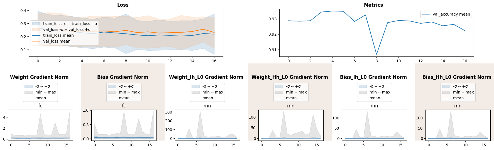
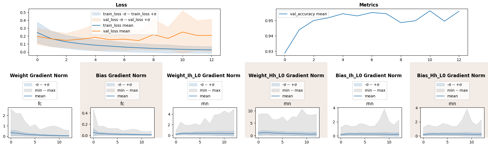
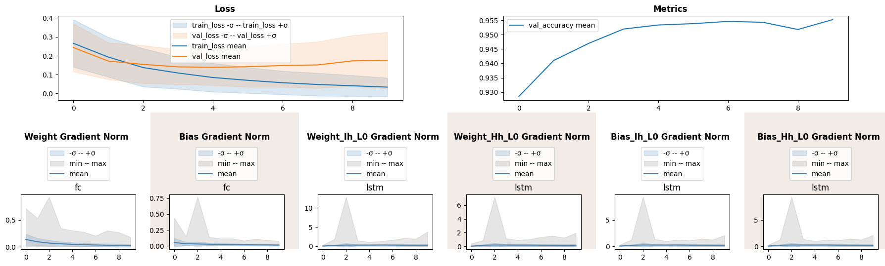

Gradient Geometry: Sentiment Analysis with RNNs
===============================================

Abstract
--------

In this notebook we dive into gradient geometry of neural networks,
tracked by ``ParameterGradientGeometry`` lens. We train severeal RNNs on
twitter sentiment analysis dataset. Most of the ideas in this notebook
are taken from `Vanishing and Exploding
Gradients <https://ai.gopubby.com/vanishing-and-exploding-gradients-5dcdf905c550>`__
by Malcolm Lett, we highly advise you to read the article.

Imports and Datasets
--------------------

.. code:: ipython3

    import numpy as np
    import pandas as pd
    import matplotlib.pyplot as plt
    
    import torch
    import torch.nn as nn
    from torch.utils.data import DataLoader, Dataset
    
    import torchtext
    torchtext.disable_torchtext_deprecation_warning()
    from torchtext.data.utils import get_tokenizer
    from torchtext.vocab import build_vocab_from_iterator
    
    from sklearn import datasets
    from sklearn.model_selection import train_test_split
    
    RND_SEED = 42
    device = torch.device('cuda' if torch.cuda.is_available() else 'cpu')
    device

.. parsed-literal::

    device(type='cpu')

We willbe using `Twitter Sentiment Analysis
Dataset <https://www.kaggle.com/datasets/durgeshrao9993/twitter-analysis-dataset-2022>`__
for this task. Each row contains anonymized tweet’s text and a binary
label if a tweet is negative.

.. code:: ipython3

    df = pd.read_csv('twitter.csv', index_col='id')
    train_df, val_df = train_test_split(
        df, random_state=RND_SEED, shuffle=True, test_size=0.2
    )

Each tweet will be represented by a sequence of 25 tokens encoded
ordinally from a vocabluary with 10k unique values.

.. code:: ipython3

    tokenizer = get_tokenizer('basic_english')
    
    def yield_tokens(data_iter):
        for text in data_iter:
            yield tokenizer(text)
    
    MAX_TOKENS = 10000
    vocab = build_vocab_from_iterator(yield_tokens(train_df['tweet']), specials=["<pad>", "<unk>"], max_tokens=MAX_TOKENS)
    vocab.set_default_index(vocab["<unk>"])
    
    PAD_IDX = vocab["<pad>"]
    
    class TweetDataset(Dataset):
        def __init__(self, df, vocab, tokenizer, max_len=25):
            self.df = df
            self.vocab = vocab
            self.tokenizer = tokenizer
            self.max_len = max_len
            
        def __len__(self):
            return len(self.df)
        
        def __getitem__(self, idx):
            global PAD_IDX
            text = self.df.iloc[idx]['tweet']
            label = self.df.iloc[idx]['label']
            tokens = self.vocab(self.tokenizer(text))
            tokens = tokens[:self.max_len] + [PAD_IDX] * (self.max_len - len(tokens))
            return torch.tensor(tokens), torch.tensor(label).float()
    
    train_dataset = TweetDataset(train_df, vocab, tokenizer)
    val_dataset = TweetDataset(val_df, vocab, tokenizer)
    
    train_loader = DataLoader(train_dataset, batch_size=32, shuffle=True)
    val_loader = DataLoader(val_dataset, batch_size=32)

Next we define standard early stopping mechanism and generic functions
for training and validation.

.. code:: ipython3

    class EarlyStopper:
        def __init__(self, patience : int = 5, eps : float = 1e-3):
            self.loss = float('+inf')
            self.timer = 0
            self.eps = eps
            self.patience = patience
    
        def __call__(self, new_loss : float) -> bool:
            if self.loss - new_loss > self.eps:
                self.loss = new_loss
                self.timer = 0
                return False
            self.timer += 1
            return self.timer >= self.patience
    
    def train_one_epoch(model, loss_fn, optimizer, dataloader=train_loader):
        for data, label in dataloader:
            pred = model(data)
            loss = loss_fn(pred, label)
            optimizer.zero_grad()
            loss.backward()
            optimizer.step()
    
    @torch.no_grad
    def validate_one_epoch(model, loss_fn, dataloader=val_loader, n_val=val_df.shape[0]):
        correctly_classified = 0
        for data, label in dataloader:
            pred = model(data)
            loss = loss_fn(pred, label)
            correctly_classified += pred.ge(0.5).float().eq(label).float().sum().item()
        return correctly_classified / n_val

Gradient Geometry Lens
----------------------

Monitorch allows to keep track of gradients with respect to both
parameters and outputs of layers (``ParameterGradientGeometry`` and
``OutputGradientGeometry`` respectively). Output gradients are even
hardered to interpret and lens usage is the same in principal, so we
will not bother to discuss it.

``ParameterGradientGeometry`` allows to keep track of L2-norm of
gradients and normalized inner product between consecutive
batch-iteration gradients. Norm helps to analyse exploding and vanishing
gradient problem, while inner product helps investigate oscilating
gradients. Later is area of active research and it is not clear how to
troubleshoot model variance produced by gradients; `Chedi Morchdi et
al. <https://www.sci.utah.edu/~beiwang/publications/Mysterious_BeiWang_2023.pdf>`__
show that neural networks learn only during oscilating phase.

To compare gradient norms between layers it is useful to have the same
scale for norms, by providing ``normalize_by_size=True`` L2-norms are
divided by square root of number of elements, hence computing RMS.

``ParameterGradientGeometry`` keeps track of every module that has all
of the parameters listed during optimization, default are ``"weight"``
and ``"bias"``.

RNN
---

Recurrent neural networks are famous for having gradient issues,
thereofre we will plot gradient norms to examine those problems.

.. code:: ipython3

    from monitorch.inspector import PyTorchInspector
    from monitorch.lens import LossMetrics, ParameterGradientGeometry
    
    loss_fn = nn.BCELoss()
    
    inspector = PyTorchInspector(
        lenses = [
            LossMetrics(
                loss_fn=loss_fn,
                metrics=['val_accuracy']
            ),
            ParameterGradientGeometry(compute_adj_prod=False),
            ParameterGradientGeometry(
                parameters=['weight_ih_l0', 'weight_hh_l0', 'bias_ih_l0', 'bias_hh_l0'],
                compute_adj_prod=False
            )
        ]
    )

Our models will consist of embedding layer for tokens, RNN and a fully
connected layer with sigmoid activation for prediction. Last hidden
state will be pushed to the fully connected layer for prediction.

.. code:: ipython3

    class SentimentRNN(nn.Module):
        def __init__(self, embed_dim, hidden_dim, nonlinearity, vocab_size=MAX_TOKENS, pad_idx=PAD_IDX):
            super().__init__()
            self.embedding = nn.Embedding(vocab_size, embed_dim, padding_idx=pad_idx)
            self.rnn = nn.RNN(embed_dim, hidden_dim, nonlinearity=nonlinearity, batch_first=True)
            self.fc = nn.Linear(hidden_dim, 1)
            self.sigmoid = nn.Sigmoid()
            
        def forward(self, text):
            embedded = self.embedding(text)
            output, hidden = self.rnn(embedded)
            return self.sigmoid(self.fc(hidden[-1])).reshape(-1)

Finally, we will train the network with tanh activation using Adam
optimizer.

.. code:: ipython3

    from tqdm import trange
    
    rnn = SentimentRNN(embed_dim=32, hidden_dim=32, nonlinearity='tanh')
    stopper = EarlyStopper()
    
    inspector.attach(rnn)
    optimizer = torch.optim.Adam(rnn.parameters())
    
    N_EPOCH = 50
    for epoch in trange(N_EPOCH):
        train_one_epoch(rnn, loss_fn, optimizer)
        val_acc = validate_one_epoch(rnn, loss_fn)
        
        inspector.push_metric('val_accuracy', val_acc)
        inspector.tick_epoch()
        
        if stopper(inspector.lenses[0].loss(train=False)):
            break
    fig = inspector.visualizer.show_fig()

.. parsed-literal::

     32%|████████████████████████████████████████████████▉                                                                                                        | 16/50 [02:41<05:43, 10.10s/it]

We see that RNN parameters experience gradient explosion near epoch 7.
Fully connected layer gradients have peaks of large magnitude later
during roughly the same epochs. All in all, the whole model strugles to
learn.

One of the reasons could be saturation of tanh unit, as it shrinks
output norms under iterated composition. Next we will train the same
network but with ReLU activation.

.. code:: ipython3

    rnn = SentimentRNN(embed_dim=32, hidden_dim=32, nonlinearity='relu')
    stopper = EarlyStopper()
    
    inspector.attach(rnn)
    optimizer = torch.optim.Adam(rnn.parameters())
    
    N_EPOCH = 50
    for epoch in trange(N_EPOCH):
        train_one_epoch(rnn, loss_fn, optimizer)
        val_acc = validate_one_epoch(rnn, loss_fn)
        
        inspector.push_metric('val_accuracy', val_acc)
        inspector.tick_epoch()
        
        if stopper(inspector.lenses[0].loss(train=False)):
            break
    fig = inspector.visualizer.show_fig()

.. parsed-literal::

     24%|████████████████████████████████████▋                                                                                                                    | 12/50 [02:04<06:33, 10.35s/it]

We have made sufficient progress, still maximal norm during each epoch
is large.

LSTM
----

One of the proposed solutions for RNN gradient issues is to train LSTM,
we hope to improve accuracy.

.. code:: ipython3

    class SentimentLSTM(nn.Module):
        def __init__(self, embed_dim, hidden_dim, vocab_size=MAX_TOKENS, pad_idx=PAD_IDX):
            super().__init__()
            self.embedding = nn.Embedding(vocab_size, embed_dim, padding_idx=pad_idx)
            self.lstm = nn.LSTM(embed_dim, hidden_dim, batch_first=True)
            self.fc = nn.Linear(hidden_dim, 1)
            self.sigmoid = nn.Sigmoid()
            
        def forward(self, text):
            embedded = self.embedding(text)
            output, (hidden, cx) = self.lstm(embedded)
            return self.sigmoid(self.fc(hidden[-1])).reshape(-1)

.. code:: ipython3

    lstm = SentimentLSTM(embed_dim=32, hidden_dim=32)
    stopper = EarlyStopper()
    
    inspector.attach(lstm)
    optimizer = torch.optim.Adam(lstm.parameters())
    
    N_EPOCH = 50
    for epoch in trange(N_EPOCH):
        train_one_epoch(lstm, loss_fn, optimizer)
        val_acc = validate_one_epoch(lstm, loss_fn)
        
        inspector.push_metric('val_accuracy', val_acc)
        inspector.tick_epoch()
        
        if stopper(inspector.lenses[0].loss(train=False)):
            break
    fig = inspector.visualizer.show_fig()

.. parsed-literal::

     18%|███████████████████████████▋                                                                                                                              | 9/50 [01:33<07:04, 10.36s/it]

LSTM indeed has helped to bound gradient norm, though there has been a
peak at epoch 2 and validation accuracy has not improved.

What to Look for
----------------

-  Gradient magnitudes should decline over course of training as model
   becomes closer to optimum.
-  Spikes or steep valleys in norms signal gradient issues.

Next Steps
----------

-  Read `an
   article <https://ai.gopubby.com/vanishing-and-exploding-gradients-5dcdf905c550>`__
   by Malcolm Lett.
-  Take a look at other demonstration notebooks and documentation.
-  Experiment with techniques tageting gradient flow such as
   normalization, residual and skip connections.

