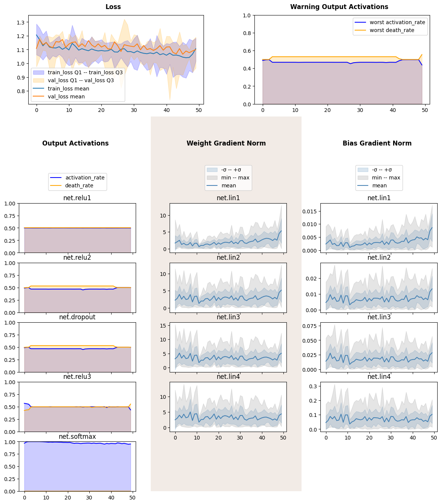
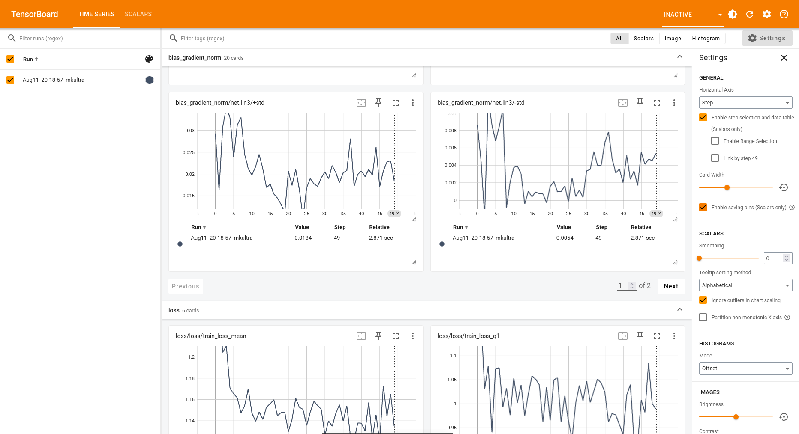

Introduction: PyTorchInspector, Lenses and Visualizers
======================================================

Abstract
--------

In this notebook we will introduce ``PyTorchInspector`` class, a gate to
monitorch, lens classes, that are responsible for data collection and
preprocessing, and visualizers. We will teach several networks for
classification on tabular dataset.

Imports and Dataset
-------------------

.. code:: ipython3

    import numpy as np
    import pandas as pd
    import matplotlib.pyplot as plt
    
    import torch
    import torch.nn as nn
    from torch.utils.data import DataLoader, TensorDataset
    
    from sklearn import datasets
    from sklearn.model_selection import train_test_split
    
    RND_SEED = 42
    device = torch.device('cuda' if torch.cuda.is_available() else 'cpu')
    device

.. parsed-literal::

    device(type='cpu')

We will train our neural net on `UCI ML Wine Data
Set <https://archive.ics.uci.edu/dataset/109/wine>`__. Our task is to
show librairy’s functionality, thus we will treat all 13 numerical
features as being anonymized, we also will not create test set to check
our model, as there is no need for that. Nevertheless, we will display
five samples from the dataset to see how a row might look.

.. code:: ipython3

    wine_dataset = datasets.load_wine()
    
    Xtrain, Xval, ytrain, yval = train_test_split(
        wine_dataset['data'], wine_dataset['target'],
        random_state=RND_SEED, shuffle=True, test_size=0.2
    )
    
    BATCH_SIZE = 8
    train_dataloader = DataLoader(
        TensorDataset(
            torch.from_numpy(Xtrain).float(), torch.from_numpy(ytrain).long()
        ),
        shuffle=True, batch_size=BATCH_SIZE
    )
    
    val_dataloader = DataLoader(
        TensorDataset(
            torch.from_numpy(Xval).float(), torch.from_numpy(yval).long()
        ),
        shuffle=True, batch_size=BATCH_SIZE
    )
    
    pd.DataFrame(
        np.concat([wine_dataset['data'], wine_dataset['target'].reshape(-1, 1)], axis=1)
    ).sample(5, random_state=RND_SEED).rename(columns={i:f'X{i}' for i in range(13)}).rename(columns={13:'target'})

.. raw:: html

    

    
    <table border="1" class="dataframe">
      <thead>
        <tr style="text-align: right;">
          <th></th>
          <th>X0</th>
          <th>X1</th>
          <th>X2</th>
          <th>X3</th>
          <th>X4</th>
          <th>X5</th>
          <th>X6</th>
          <th>X7</th>
          <th>X8</th>
          <th>X9</th>
          <th>X10</th>
          <th>X11</th>
          <th>X12</th>
          <th>target</th>
        </tr>
      </thead>
      <tbody>
        <tr>
          <th>19</th>
          <td>13.64</td>
          <td>3.10</td>
          <td>2.56</td>
          <td>15.2</td>
          <td>116.0</td>
          <td>2.70</td>
          <td>3.03</td>
          <td>0.17</td>
          <td>1.66</td>
          <td>5.10</td>
          <td>0.96</td>
          <td>3.36</td>
          <td>845.0</td>
          <td>0.0</td>
        </tr>
        <tr>
          <th>45</th>
          <td>14.21</td>
          <td>4.04</td>
          <td>2.44</td>
          <td>18.9</td>
          <td>111.0</td>
          <td>2.85</td>
          <td>2.65</td>
          <td>0.30</td>
          <td>1.25</td>
          <td>5.24</td>
          <td>0.87</td>
          <td>3.33</td>
          <td>1080.0</td>
          <td>0.0</td>
        </tr>
        <tr>
          <th>140</th>
          <td>12.93</td>
          <td>2.81</td>
          <td>2.70</td>
          <td>21.0</td>
          <td>96.0</td>
          <td>1.54</td>
          <td>0.50</td>
          <td>0.53</td>
          <td>0.75</td>
          <td>4.60</td>
          <td>0.77</td>
          <td>2.31</td>
          <td>600.0</td>
          <td>2.0</td>
        </tr>
        <tr>
          <th>30</th>
          <td>13.73</td>
          <td>1.50</td>
          <td>2.70</td>
          <td>22.5</td>
          <td>101.0</td>
          <td>3.00</td>
          <td>3.25</td>
          <td>0.29</td>
          <td>2.38</td>
          <td>5.70</td>
          <td>1.19</td>
          <td>2.71</td>
          <td>1285.0</td>
          <td>0.0</td>
        </tr>
        <tr>
          <th>67</th>
          <td>12.37</td>
          <td>1.17</td>
          <td>1.92</td>
          <td>19.6</td>
          <td>78.0</td>
          <td>2.11</td>
          <td>2.00</td>
          <td>0.27</td>
          <td>1.04</td>
          <td>4.68</td>
          <td>1.12</td>
          <td>3.48</td>
          <td>510.0</td>
          <td>1.0</td>
        </tr>
      </tbody>
    </table>
    

Neural Net Definition
---------------------

We will define a simple neural net for our task, it will include three
hidden layers with ReLU activations and a softmax output. We will allow
a custom probability dropout between the second and the third layers. We
will also define functions to train and validate one epoch.

.. code:: ipython3

    from collections import OrderedDict
    
    class SimpleMLP(nn.Module):
    
        def __init__(self, dropout_p=0):
            super().__init__()
            self.net = nn.Sequential(OrderedDict([
                ('lin1', nn.Linear(13, 32)),
                ('relu1', nn.ReLU()),
    
                ('lin2', nn.Linear(32, 32)),
                ('relu2', nn.ReLU()),
    
                ('dropout', nn.Dropout(dropout_p)),
                ('lin3', nn.Linear(32, 16)),
                ('relu3', nn.ReLU()),
                
                ('lin4', nn.Linear(16, 3)),
                ('softmax', nn.Softmax(dim=1)),
            ]))
    
        def forward(self, X):
            return self.net(X)
    
        @torch.no_grad
        def predict(self, X):
            return self.net(X).argmax(dim=1)
    
    def train_one_epoch(model, loss_fn, optimizer, train_dataloader=train_dataloader):
        """ Trains model through dataset one time. Returns mean loss accross batches. """
        loss_agg = 0
        for data, label in train_dataloader:
            optimizer.zero_grad()
            pred = model(data)
            loss = loss_fn(pred, label)
            loss.backward()
            optimizer.step()
            loss_agg += loss.item()
        train_n_samples = train_dataloader.dataset.tensors[0].shape[0]
        return loss_agg / train_n_samples
    
    @torch.no_grad
    def validate_one_epoch(model, loss_fn, val_dataloader=val_dataloader):
        """ Validates through given dataset, returns accuracy and mean loss accross batches. """
        correctly_classified = 0
        loss_agg = 0
        for data, label in val_dataloader:
            pred = model(data)
            loss = loss_fn(pred, label)
            correctly_classified += pred.argmax(dim=1).eq(label).float().sum().item()
            loss_agg += loss.item()
        val_n_samples = val_dataloader.dataset.tensors[0].shape[0]
        return correctly_classified / val_n_samples, loss_agg / val_n_samples

Inspector Definition
--------------------

Monitorch uses built-in PyTorch hooks to collect training data, classes
from ``monitorch.lens`` manage callbacks and data flow, they can be
customized using initialization flags to serve your needs. Classes from
``monitorch.visualizer`` are responsible for communication between
lenses and visualization libraries such as Matplotlib and TensorBoard.
``PyTorchInspector`` is a class that connects visualizer, lenses and
user-defined PyTorch modules. Almost all of the configuration is done
through inspector.

To start one needs to provide list of lenses, in this notebook we will
use ``LossMetrics``, ``OutputActivation`` and ``ParameterNorm`` lenses;
they will be discussed in detail in later notebooks, for our goal it is
sufficient to note that ``LossMetrics`` automatically collects loss
data, if provided loss function, while ``OutputActivation`` and
``ParameterNorm`` collect per layer data during training.

``PyTorchInspector`` allows to define visualizer from the very start,
one can choose any object of concrete subclass of
``AbstractVisualizer``, or provide string ``'matplotlib'``,
``'tensorboard'`` or ``'print'``. Default is ``'matplotlib'``.

``PyTorchInspector`` also collects layers from neural net, use ``depth``
initialization parameter to control what layers should be displayed.
Default is to traverse until module does not contain any submodules.

Further inspector configuration can be found at the dedicated
documentation page.

.. code:: ipython3

    from monitorch.inspector import PyTorchInspector
    from monitorch.lens import LossMetrics, OutputActivation, ParameterGradientGeometry
    
    loss_fn = nn.CrossEntropyLoss()
    
    inspector = PyTorchInspector(
        lenses = [
            LossMetrics(
                loss_fn=loss_fn,
                loss_fn_inplace=False,
                loss_range='Q1-Q3'
            ),
            OutputActivation(),
            ParameterGradientGeometry(compute_adj_prod=False)
        ]
    )

Base Usage
----------

To use predefined inspector, one needs to attach the inspector to the
module, then proceed to training as they do usually. At the end of each
epoch inspector must be signaled about an end of an epoch using
``tick_epoch()``. That is it! No more additional steps are need to
collect data.

Matplotlib visualizer also requires calling ``show_fig()`` to draw
plots. Other visualizers draw plots online.

.. code:: ipython3

    model = SimpleMLP()
    
    optimizer = torch.optim.Adam(
        model.parameters(),
        lr=0.0005
    )
    inspector.attach(model)
    
    N_EPOCHS = 50
    
    for epoch in range(N_EPOCHS):
        train_one_epoch(model, loss_fn, optimizer)
        validate_one_epoch(model, loss_fn)
        inspector.tick_epoch()
    fig = inspector.visualizer.show_fig()

Detach-Attach
-------------

One of the main reasons, why we plot data about neural networks, is to
compare them between each other. For that ``PyTorchInspector`` is
capable to detach and attach to a module, therefore allowing itself to
be reused without polluting code with reinitialization.

We will create a new model with destructive dropout and inspect it with
the very same object. Pay attention to activation of ``net.relu3``.

.. code:: ipython3

    model = SimpleMLP(dropout_p=0.5)
    
    optimizer = torch.optim.Adam(
        model.parameters(),
        lr=0.001
    )
    
    inspector.attach(model)
    
    N_EPOCHS = 50
    
    for epoch in range(N_EPOCHS):
        train_one_epoch(model, loss_fn, optimizer)
        acc, loss = validate_one_epoch(model, loss_fn)
        inspector.tick_epoch()
    fig = inspector.visualizer.show_fig()

We see that death rate was a lot smaller and weight gradient of
corresponding linear layer was more stable.

Hot-Swapping Visualizer
-----------------------

Due to modular structure of ``PyTorchInspector`` visualizer can be
replaced by more appropriate tool. To illustrate it we will use
``TensorBoardVisualizer`` on the inspector.

.. code:: ipython3

    from monitorch.visualizer import TensorBoardVisualizer
    inspector.detach().visualizer = TensorBoardVisualizer()
    
    model = SimpleMLP(dropout_p=0.5)
    
    optimizer = torch.optim.Adam(
        model.parameters(),
        lr=0.0005
    )
    
    inspector.attach(model)
    
    N_EPOCHS = 50
    
    for epoch in range(N_EPOCHS):
        train_one_epoch(model, loss_fn, optimizer)
        acc, loss = validate_one_epoch(model, loss_fn)
        inspector.tick_epoch()

Code above will generate data displayable by Tensorboard like a picture
below. One could view tensorboard in the notebook using jupyter magics
like ``%load_ext`` and ``%tensorboard --logdir='runs'``.

   TensorBoard example

Be aware that TensorBoard provides much smaller subset of plotting
options, than Matplotlib does, so band plots are split into upper and
lower bound, while relation plots create new “runs” for every subtag
(i.e. layer).

Next Steps
----------

-  Try monitorch on your favourite dataset.
-  Take a look at other demonstration notebooks and documentation.
-  Find what lenses expose problem with neural networks that you
   encounter.

