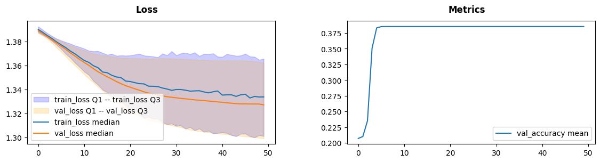
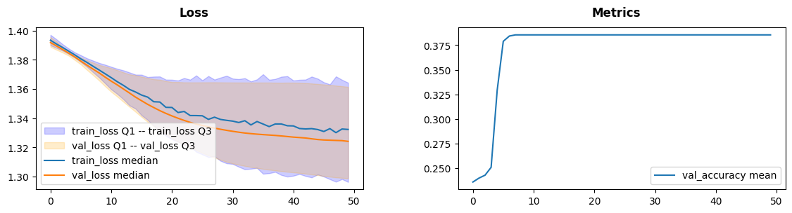
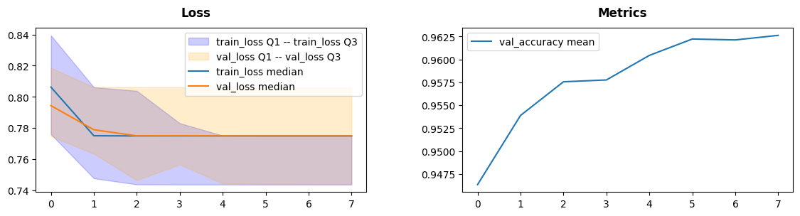

Loss and Metrics: Ecommerece Text Classification
================================================

Abstract
--------

In this notebook we will discuss ``LossMetrics`` lens and its
applications for text classification.

Imports and Dataset
-------------------

.. code:: ipython3

    import warnings
    
    import numpy as np
    import pandas as pd
    import matplotlib.pyplot as plt
    
    import torch
    import torch.nn as nn
    from torch.utils.data import DataLoader, TensorDataset
    from torch.nn.utils.rnn import pad_sequence
    
    warnings.simplefilter("ignore")
    
    from torchvision import transforms
    from torchtext.datasets import IMDB
    from torchtext.data.utils import get_tokenizer
    from torchtext.vocab import build_vocab_from_iterator
    
    warnings.simplefilter("default")
    
    from sklearn.model_selection import train_test_split
    
    RND_SEED = 42
    device = torch.device('cuda' if torch.cuda.is_available() else 'cpu')
    device

.. parsed-literal::

    device(type='cpu')

For this task we will use `Ecommerce Text
Classification <https://www.kaggle.com/datasets/saurabhshahane/ecommerce-text-classification>`__
dataset. It contains class of an item (**Electronics**, **Household**,
**Books** and **Clothing & Accessories**) and its description.

.. code:: ipython3

    df = pd.read_csv("ecommerceDataset.csv", header=None, names=["label", "text"]).fillna("")
    Xtrain, Xval, ytrain, yval = train_test_split(
        df.text, df.label, shuffle=True, random_state=RND_SEED, test_size=0.2
    )
    df.sample(5, random_state=RND_SEED)

.. raw:: html

    

    
    <table border="1" class="dataframe">
      <thead>
        <tr style="text-align: right;">
          <th></th>
          <th>label</th>
          <th>text</th>
        </tr>
      </thead>
      <tbody>
        <tr>
          <th>35848</th>
          <td>Clothing &amp; Accessories</td>
          <td>Kandy Men's Regular Fit Blazer Blue This produ...</td>
        </tr>
        <tr>
          <th>13005</th>
          <td>Household</td>
          <td>HealthSense Chef-Mate KS 50 Digital Kitchen Sc...</td>
        </tr>
        <tr>
          <th>22719</th>
          <td>Books</td>
          <td>Concept of Physics (2018-2019) Session (Set of...</td>
        </tr>
        <tr>
          <th>18453</th>
          <td>Household</td>
          <td>Lista Stainless Steel Multi Functional Hammer ...</td>
        </tr>
        <tr>
          <th>20867</th>
          <td>Books</td>
          <td>Gardening in Urban India update</td>
        </tr>
      </tbody>
    </table>
    

We will use ``torchtext`` utilities to tokenize dataset and encode each
word as its index in vocabluary with 10K words. Each description then
will be either padded or truncated to be 32 tokens long, it will make
the data to be ready to use.

.. code:: ipython3

    tokenizer = get_tokenizer("basic_english")
    
    def yield_tokens(text_iter):
        for text in text_iter:
            yield tokenizer(text)
    
    MAX_TOKENS = 10000
    vocab = build_vocab_from_iterator(
        yield_tokens(Xtrain.values),
        specials=[ "<pad>", "<unk>"],
        max_tokens=MAX_TOKENS
    )
    vocab.set_default_index(vocab["<unk>"])
    
    MAX_LEN = 32
    PAD_IDX = vocab["<pad>"]
    
    def encode(text):
        tokens = tokenizer(text)
        ids = vocab(tokens)
        if len(ids) < MAX_LEN:
            ids += [PAD_IDX] * (MAX_LEN - len(ids))
        else:
            ids = ids[:MAX_LEN]
        return ids
    
    Xtrain_ids = torch.tensor([encode(t) for t in Xtrain], dtype=torch.long)
    Xval_ids = torch.tensor([encode(t) for t in Xval], dtype=torch.long)
    
    label_to_idx = {label: i for i, label in enumerate(sorted(df.label.unique()))}
    ytrain_ids = torch.tensor([label_to_idx[l] for l in ytrain], dtype=torch.long)
    yval_ids = torch.tensor([label_to_idx[l] for l in yval], dtype=torch.long)
    
    BATCH_SIZE = 32
    train_ds = TensorDataset(Xtrain_ids, ytrain_ids)
    val_ds = TensorDataset(Xval_ids, yval_ids)
    
    train_loader = DataLoader(train_ds, batch_size=BATCH_SIZE, shuffle=True)
    val_loader = DataLoader(val_ds, batch_size=BATCH_SIZE)

Neural Network Definition
-------------------------

For this task we will embded each token into a 32 dimensional space,
than take a mean embeding over all tokens in a text and pass it through
a two layer neural net with ReLU activations and softmax output.

.. code:: ipython3

    class TextClassifier(nn.Module):
    
        def __init__(self, embedding_dim, hidden_dim):
            global MAX_TOKENS, PAD_IDX, label_to_idx
            super().__init__()
            self.embedder = nn.Embedding(
                MAX_TOKENS, embedding_dim, padding_idx=PAD_IDX
            )
            self.lin1 = nn.Linear(embedding_dim, hidden_dim)
            self.lin2 = nn.Linear(hidden_dim, len(label_to_idx))
            self.softmax = nn.Softmax(dim=1)
    
        def forward(self, X):
            embedding = self.embedder(X).mean(dim=1)
            t = torch.relu(self.lin1(embedding))
            return self.softmax(self.lin2(t))

We will also define an early stopping mechanism for regularization.

.. code:: ipython3

    class EarlyStopper:
        def __init__(self, patience : int = 5, eps : float = 1e-3):
            self.loss = float('+inf')
            self.timer = 0
            self.eps = eps
            self.patience = patience
    
        def __call__(self, new_loss : float) -> bool:
            if self.loss - new_loss > self.eps:
                self.loss = new_loss
                self.timer = 0
                return False
            self.timer += 1
            return self.timer >= self.patience

Explicit Loss saving
--------------------

``LossMetrics`` from ``monitorch.lens`` is designed to be a drop in loss
recording tool. During its initialization user may define what
aggregations will be used by providing ``loss_line`` and ``loss_ranges``
parameters. To display custom metrics they must be declared to a lens
during initialization, their aggregations can be tweaked the same way
the loss are done by changing ``metrics_line`` and ``metrics_ranges``.

The lens allows two ways to record loss, one through an explicit call on
inspector and another one by providing loss function module to the lens.
The first one feels more natural so, we will start with that. To save
loss one needs to call ``push_loss`` on an inspector and provide whether
the loss is training or not. There is a symmetric method for metrics
``push_metric`` that also requries to provide name of the metric pushed.
Both of them can be tweaked by optional flag ``running`` to be in-place
(default) or in-memory.

.. code:: ipython3

    from monitorch.inspector import PyTorchInspector
    from monitorch.lens import LossMetrics
    
    inspector = PyTorchInspector(
        lenses = [LossMetrics(
            loss_line='median',
            loss_range=['Q1-Q3'],
            metrics = ['val_accuracy']
        )]
    )

Let us train a neural net with 16 hidden neurons using stochastic
gradient descent. To obtain a validation loss from last finished epoch
one could use ``loss(train=False)`` on the lens object, that way it can
be provided to our early stopper.

.. code:: ipython3

    model = TextClassifier(32, 16)
    stopper = EarlyStopper()
    
    inspector.attach(model)
    loss_fn = nn.CrossEntropyLoss()
    optimizer = torch.optim.SGD(
        model.parameters(),
        lr=0.001
    )
    
    N_EPOCH = 50
    for epoch in range(N_EPOCH):
    
        # Train
        for data, label in train_loader:
            pred = model(data)
            loss = loss_fn(pred, label)
            optimizer.zero_grad()
            loss.backward()
            optimizer.step()
            inspector.push_loss(loss.item(), train=True, running=False) # pushing training loss
    
        # Validation
        correctly_classified = 0
    
        with torch.no_grad():
            for data, label in val_loader:
                pred = model(data)
                loss = loss_fn(pred, label)
                inspector.push_loss(loss.item(), train=False, running=False) # pushing validation loss
                correctly_classified += pred.argmax(dim=1).eq(label).float().sum().item()
        
        inspector.push_metric('val_accuracy', correctly_classified / Xval.shape[0]) # pushing validation accuracy
        
        inspector.tick_epoch()
        if stopper(inspector.lenses[0].loss(train=False)): # extracting validation loss from lens
            break
        
    fig = inspector.visualizer.show_fig()

Automatic Loss Saving
---------------------

Another option is to provide a loss function to the lens during
initialization, this way no explicit calls must be made. Nevertheless,
for the loss to be recorded it must be firstly computed. Training
requires a loss to backpropagate through, so training pass is not
changed, but we need to compute loss in a validation pass, inspite that
it is not used anywhere explicitly. Loss function module cannot be
disconnected from lens withour direct interegation, so ``detach`` and
``attach`` calls can be done without reattaching loss function.

With those thoughts in mind we can define simple functions for training
and leave all of the tracing for the inspector and lenses, making our
code more expressive.

.. code:: ipython3

    def train_one_epoch(model, loss_fn, optimizer, dataloader=train_loader):
        for data, label in dataloader:
            pred = model(data)
            loss = loss_fn(pred, label)
            optimizer.zero_grad()
            loss.backward()
            optimizer.step()
    
    @torch.no_grad
    def validate_one_epoch(model, loss_fn, dataloader=val_loader, n_val=Xval.shape[0]):
        correctly_classified = 0
        for data, label in dataloader:
            pred = model(data)
            loss = loss_fn(pred, label)
            correctly_classified += pred.argmax(dim=1).eq(label).float().sum().item()
        return correctly_classified / n_val

Below we redefine inspector to record loss from loss function.

.. code:: ipython3

    loss_fn = nn.CrossEntropyLoss()
    
    inspector = PyTorchInspector(
        lenses = [LossMetrics(
            loss_fn=loss_fn,
            loss_fn_inplace=False,
            loss_line='median',
            loss_range=['Q1-Q3'],
            metrics = ['val_accuracy']
        )]
    )

We will now train the very same network to be sure about equivalence of
both tracking methods.

.. code:: ipython3

    model = TextClassifier(32, 16)
    stopper = EarlyStopper()
    
    inspector.attach(model)
    optimizer = torch.optim.SGD(
        model.parameters(),
        lr=0.001
    )
    
    N_EPOCH = 50
    for epoch in range(N_EPOCH):
        train_one_epoch(model, loss_fn, optimizer)
        val_acc = validate_one_epoch(model, loss_fn)
        
        inspector.push_metric('val_accuracy', val_acc)
        inspector.tick_epoch()
        
        if stopper(inspector.lenses[0].loss(train=False)):
            break
    fig = inspector.visualizer.show_fig()

Training slows after 30 epochs, that can be either a problem of a net
being too shallow or a problem of our training procedure.

Lastly we will train our model with RMSprop optimizer to get better
results.

.. code:: ipython3

    model = TextClassifier(32, 16)
    stopper = EarlyStopper()
    
    inspector.attach(model)
    optimizer = torch.optim.RMSprop(
        model.parameters()
    )
    
    N_EPOCH = 50
    for epoch in range(N_EPOCH):
        train_one_epoch(model, loss_fn, optimizer)
        val_acc = validate_one_epoch(model, loss_fn)
        
        inspector.push_metric('val_accuracy', val_acc)
        inspector.tick_epoch()
        
        if stopper(inspector.lenses[0].loss(train=False)):
            break
    fig = inspector.visualizer.show_fig()

RMSprop was able to learn the data quick (7 epochs) with 96% accuracy we
call it a success.

What to Look for
----------------

-  Loss plateaus are generally a sign of a problem with one of the parts
   of the procedure
-  Too much variance in training loss could signal gradient issues (see
   ``GradientGeometry`` for that)

Next steps
----------

-  Try ``LossMetrics`` for training your neural networks on other
   datasets.
-  Take a look at other demonstration notebooks and documentation.
-  Find how complex losses behave, such as bounding box loss or a CTC
   loss.

