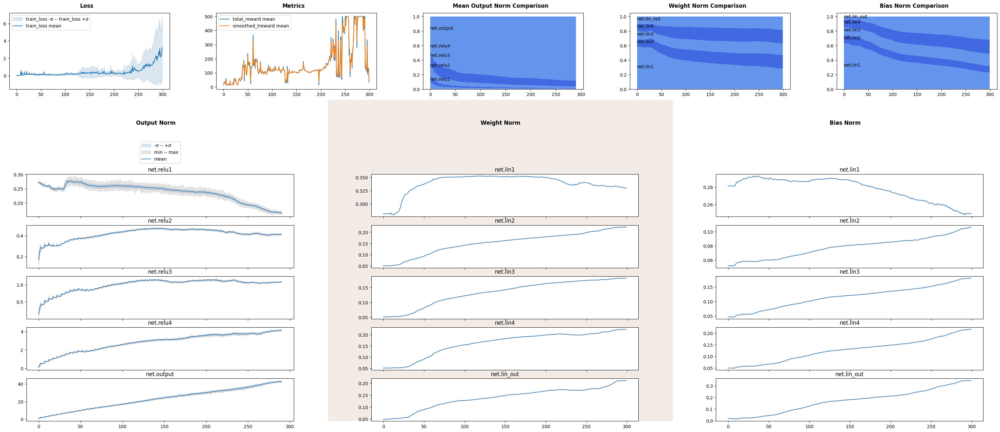

Ouput and Parameter Norm: Deep Q-Network for CartPole
=====================================================

Abstract
--------

In this notebook we will introduce output and parameter norm tracking.
We will train a deep Q-network for CartPole from gymnasium library.

Imports and Environment
-----------------------

.. code:: ipython3

    import numpy as np
    import pandas as pd
    import matplotlib.pyplot as plt
    
    import gymnasium as gym
    import torch
    import torch.nn as nn
    from torch.utils.data import DataLoader, TensorDataset
    
    RND_SEED = 42
    device = torch.device('cuda' if torch.cuda.is_available() else 'cpu')
    device

.. parsed-literal::

    device(type='cpu')

.. code:: ipython3

    env = gym.make("CartPole-v1")
    env

.. parsed-literal::

    <TimeLimit<OrderEnforcing<PassiveEnvChecker<CartPoleEnv<CartPole-v1>>>>>

Output Norm Lens
----------------

``OutputNorm`` is a lens that provides functionality to track output
norm on every forward pass. By default it skips passes made with
``torch.no_grad``, this behaviour can be tweaked by
``skip_no_grad_pass`` initialization argument.

Default configuation keeps track of all activations functions, one could
add or exclude certain module classes using ``include`` and ``exclude``
parameters.

For ease of comparison the lens allows to normalize outputs by square
root of number of elements in the tensor, that way one could coprehend
rough magnitudes of standalone neuron outputs.

Parameter Norm Lens
-------------------

``ParameterNorm`` lens allows to keep track of L2-norms or RMS of
parameters on every tick of an epoch i.e. ``inspector.tick_epoch()``. If
norms must be calculated more often lens provides a public ``collect()``
method to aggregate norm data.

The lens keeps track of parameters provided during initialization, for
module to be tracked it must have all of the listed parameters.

As well as ``OutputNorm``, parameter norms can be normalized by square
root of number of elements.

Both lenses can draw comparison plots to give the relationship between
layers in one single window.

.. code:: ipython3

    from monitorch.inspector import PyTorchInspector
    from monitorch.lens import LossMetrics, OutputNorm, ParameterNorm
    
    loss_fn = nn.MSELoss()
    
    inspector = PyTorchInspector(
        lenses = [
            LossMetrics(
                loss_fn=loss_fn,
                metrics=['total_reward', 'smoothed_treward']
            ),
            OutputNorm(include=[nn.Identity], normalize_by_size=True),
            ParameterNorm(normalize_by_size=True)
        ]
    )

CartPole
--------

We will implement a DQN algorithm with 4-layer neural network defined
below.

.. code:: ipython3

    from collections import OrderedDict
    
    class QNetwork(nn.Module):
    
        def __init__(self, state_dim, action_dim):
            super().__init__()
            self.net = nn.Sequential(OrderedDict([
                ('lin1',  nn.Linear(state_dim, 128)),
                ('relu1', nn.ReLU()),
                
                ('lin2',  nn.Linear(128, 128)),
                ('relu2', nn.ReLU()),
                
                ('lin3',  nn.Linear(128, 128)),
                ('relu3', nn.ReLU()),
                
                ('lin4',  nn.Linear(128, 128)),
                ('relu4', nn.ReLU()),
    
                ('lin_out', nn.Linear(128, action_dim)),
                ('output',  nn.Identity())
            ]))
    
        def forward(self, X):
            return self.net(X)

Here we define a replay buffer for the algorithm to save episode data
into and for the network data to learn from.

.. code:: ipython3

    from collections import deque, namedtuple
    
    Transition = namedtuple("Transition", ("state", "action", "reward", "next_state", "done"))
    
    class ReplayBuffer:
        def __init__(self, capacity=10000):
            self.buffer = deque(maxlen=capacity)
    
        def push(self, *args):
            self.buffer.append(Transition(*args))
    
        def sample(self, batch_size):
            batch = random.sample(self.buffer, batch_size)
            return Transition(*zip(*batch))
    
        def __len__(self):
            return len(self.buffer)

.. code:: ipython3

    state_dim = env.observation_space.shape[0]
    action_dim = env.action_space.n

Now we will train Q-network for 300 episodes with decaying epsilon
greedy action selection. Our buffer will have 20000 memory slots.

.. code:: ipython3

    import warnings
    import random
    from tqdm import trange
    
    warnings.simplefilter('ignore')
    
    policy_net = QNetwork(state_dim, action_dim)
    target_net = QNetwork(state_dim, action_dim)
    target_net.load_state_dict(policy_net.state_dict())
    target_net.eval()
    
    inspector.attach(policy_net)
    optimizer = torch.optim.AdamW(policy_net.parameters(), lr=1e-3)
    
    buffer = ReplayBuffer(20000)
    BATCH_SIZE = 256
    
    gamma = 0.99
    eps_start, eps_end, eps_decay = 1.0, 0.05, 1000
    
    steps_done = 0
    N_EPISODES = 300
    smoothing_factor = 0.2
    smoothed_treward = 0
    for episode in trange(N_EPISODES):
        state, _ = env.reset()
        state = torch.tensor(state, dtype=torch.float32).unsqueeze(0)
        total_reward = 0
    
        for t in range(500):
            # Epsilon-greedy action
            eps_threshold = eps_end + (eps_start - eps_end) * np.exp(-1. * steps_done / eps_decay)
            steps_done += 1
            if random.random() < eps_threshold:
                action = torch.tensor([[random.randrange(action_dim)]], dtype=torch.long)
            else:
                with torch.no_grad():
                    q_values = policy_net(state)
                    action = q_values.argmax(dim=1, keepdim=True)
    
            # Step environment
            next_state, reward, terminated, truncated, _ = env.step(action.item())
            total_reward += reward
            done = terminated or truncated
            next_state = torch.tensor(next_state, dtype=torch.float32).unsqueeze(0)
            buffer.push(state, action, reward, next_state, done)
            state = next_state
    
            # Optimize
            if len(buffer) > BATCH_SIZE:
                transitions = buffer.sample(BATCH_SIZE)
                batch = Transition(*transitions)
    
                non_final_mask = ~torch.tensor(batch.done, dtype=torch.bool)
                non_final_next_states = torch.cat([s for s, d in zip(batch.next_state, batch.done) if not d])
    
                state_batch = torch.cat(batch.state)
                action_batch = torch.cat(batch.action)
                reward_batch = torch.tensor(batch.reward, dtype=torch.float32)
    
                q_values = policy_net(state_batch).gather(1, action_batch)
    
                next_q_values = torch.zeros(BATCH_SIZE)
                with torch.no_grad():
                    next_q_values[non_final_mask] = target_net(non_final_next_states).max(1)[0]
    
                expected_q_values = reward_batch + gamma * next_q_values
                loss = loss_fn(q_values.squeeze(), expected_q_values)
    
                optimizer.zero_grad()
                loss.backward()
                optimizer.step()
            if done:
                break
    
        smoothed_treward = (1 - smoothing_factor)* total_reward + smoothing_factor * smoothed_treward
        inspector.push_metric('total_reward', total_reward)
        inspector.push_metric('smoothed_treward', smoothed_treward)
        inspector.tick_epoch()
    
        # Update target network
        if episode % 5 == 0:
            target_net.load_state_dict(policy_net.state_dict())
    fig = inspector.visualizer.show_fig()

.. parsed-literal::

    100%|███████████████████████████████████████████████████████████████████████████████████████████████████████████████████████████████████████████████████████| 300/300 [03:33<00:00,  1.40it/s]

We see jagged corners at every fifth episode, when target network was
update and neural network needed to learn a new landscape, outputs are
domintated by output layer, as it is an estimation of utility function
and has the largest values accross network.

What to Look for
----------------

-  Spikes of norms may signal gradient issues.
-  Classification tasks usually lead to values near zero, thus norm will
   be small, while regression task as a Q-learning should gradually
   increase or decrease output norms and parameters norms to match
   target magnitude.

Next Steps
----------

-  Take a look at other demonstration notebooks and documentation.
-  Experiment with other RL environments and algortithm such as
   policy-gradient improvment to investigate norm development.

